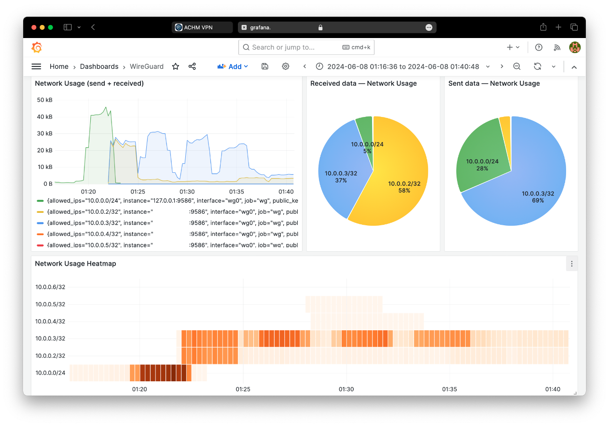
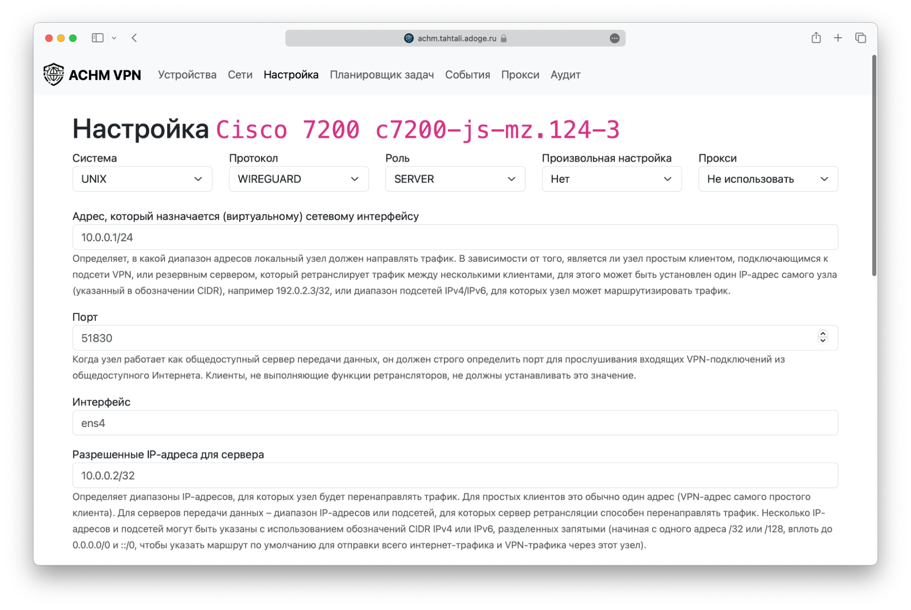
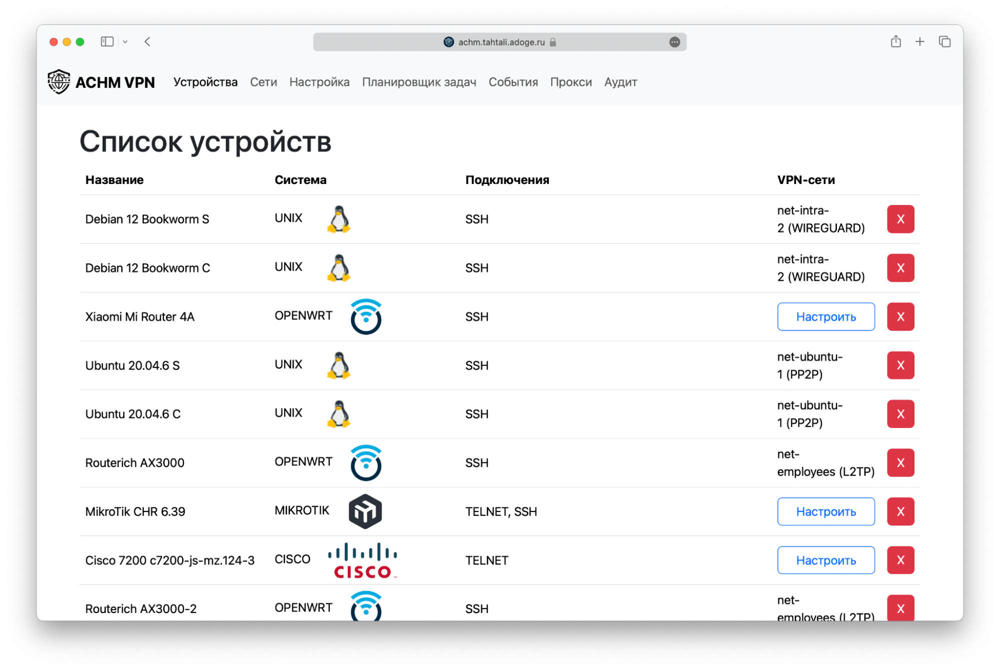
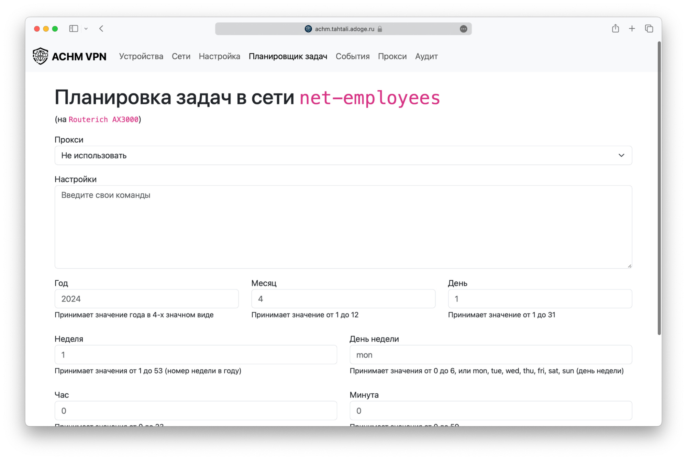
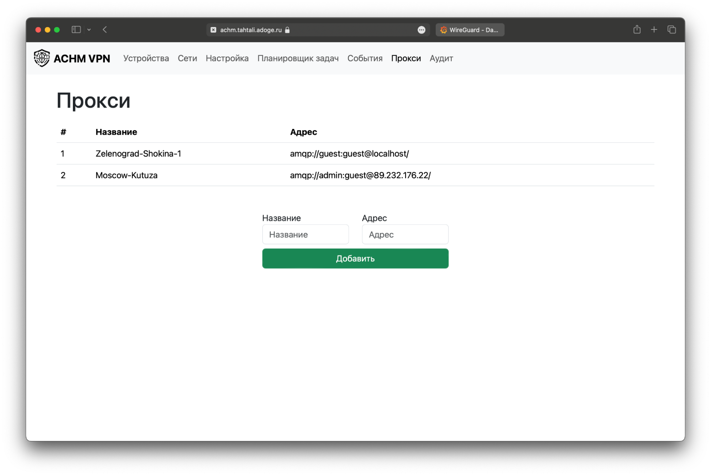
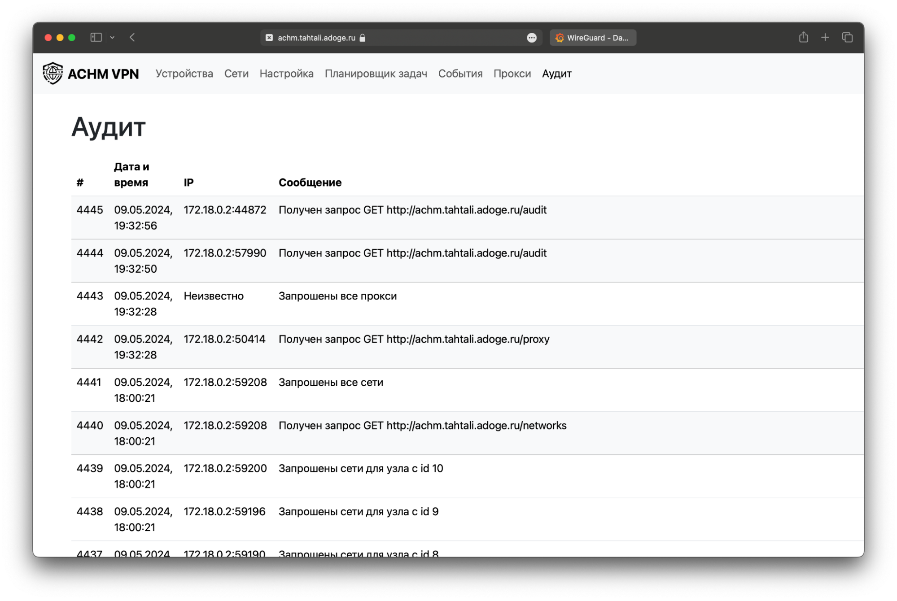
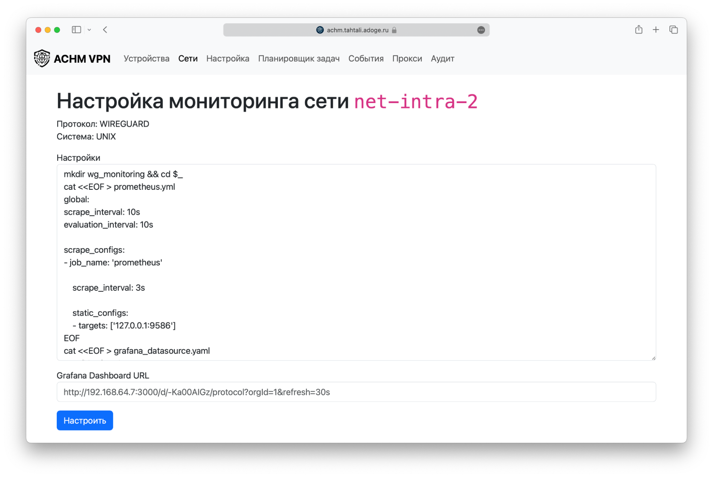
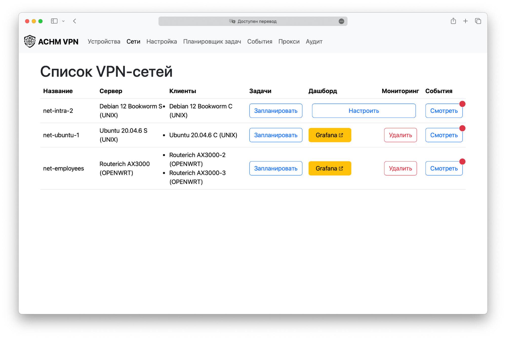

## ACHM VPN: Автоматизированная система по настройке и мониторингу VPN

### Запуск основного сервиса
```bash
make init
make run
```

### Запуск прокси-сервиса
```bash
cd proxy_server
make run
```


### UML-диаграмма последовательности настройки сетевого устройства


### Пример настроенного мониторинга WireGuard


### Интерфейс АС







